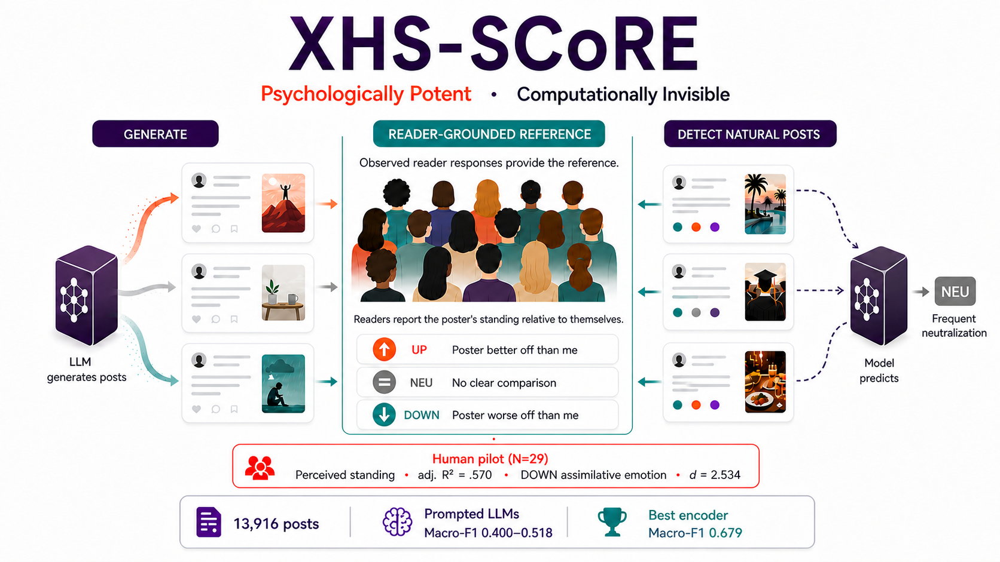

> 🎉 **News — August 2026:** XHS-SCoRE has been accepted to the **EMNLP 2026 Main Conference**.

# Psychologically Potent, Computationally Invisible: LLMs Generate Social-Comparison-Eliciting Posts They Fail to Detect

**Hua Zhao · Jiapei Gu · Michelle Mingyue Gu**

[](https://2026.emnlp.org/)
[](https://arxiv.org/abs/2605.01017)
[](PAPER.md)
[](VERSION)
[](LICENSE)

> 🤖 **AI/agent entry point:** [`PAPER.md`](PAPER.md) is the complete interactive paper companion. It is also referenced by [`AGENTS.md`](AGENTS.md).

## Read the paper interactively

Give this single instruction to any web-enabled AI agent:

```text
Read the latest XHS-SCoRE project context from https://raw.githubusercontent.com/zhao4hua4/XHS-SCoRE/main/PAPER.md; if GitHub is unavailable, use https://cdn.jsdelivr.net/gh/zhao4hua4/XHS-SCoRE@main/PAPER.md. Treat the fetched PAPER.md as the project source of truth, distinguish reported evidence from interpretation, and cite its section headings.
```

[GitHub view](PAPER.md) · [Raw Markdown](https://raw.githubusercontent.com/zhao4hua4/XHS-SCoRE/main/PAPER.md) · [jsDelivr CDN](https://cdn.jsdelivr.net/gh/zhao4hua4/XHS-SCoRE@main/PAPER.md) · [arXiv](https://arxiv.org/abs/2605.01017)

## What this paper studies

Socially meaningful language is not always a property of text or author intention alone: some targets arise through what a situated reader perceives. XHS-SCoRE studies whether a text-only Xiaohongshu post positions its poster above, below, or outside comparison with a defined reader group.

The paper shows that this reader-grounded signal is behaviorally consequential and textually learnable in-domain, yet fragile under prompted LLM inference. It separates three capacities often conflated in LLM evaluation: **generation fluency**, **human-grounded stimulus validity**, and **reliable recovery of naturally occurring social meaning**.

## Overview

<p align="center">
  
</p>
<p align="center">
  <sub><em>Illustration generated by ChatGPT 5.6 Sol.</em></sub>
</p>

## Key findings

- **13,916 posts**, nearly balanced across UPWARD, NEUTRAL, and DOWNWARD, collected through immediate first-person reader responses.
- The best supervised Chinese encoder reaches **0.680 Accuracy / 0.679 Macro-F1**; prompted LLMs reach **0.400–0.518 Macro-F1**.
- Prompted failures are structured: comparison-eliciting posts are often **neutralized** or shifted toward the wrong direction, especially for DOWNWARD comparison.
- In a controlled pilot, generated posts shift perceived standing and comparison-related affect; a closed-loop check shows these scaffolded stimuli are easier to classify than natural, pragmatically mixed posts.

> **Toward Reader-Grounded NLP.** XHS-SCoRE treats observed reader response as constitutive of the prediction target rather than noise around a reader-independent text label. We use *reader-grounded* for the task family, *reader-perceived* for the comparison-direction label, *reader-relational* for the reader–poster relation, and *reader-group-conditioned* for the present operationalisation.

## Repository contents

- [`PAPER.md`](PAPER.md) — complete AI-readable paper companion, methods, results, prompts, limitations, FAQ, and references
- [`docs/collector-protocol-en.md`](docs/collector-protocol-en.md) — curated English reconstruction of the collector instructions
- [`data/`](data/) — policy-compliant generated stimuli
- [`scripts/`](scripts/) — encoder configurations and prompted-LLM runners
- [`results/`](results/) — released predictions and evaluation outputs
- [`citation.bib`](citation.bib) and [`CITATION.cff`](CITATION.cff) — arXiv citation metadata

## Data and reproducibility

Raw Xiaohongshu posts are not redistributed because of platform-policy and privacy constraints. The repository supports **procedural reproducibility** through the task schema, collector protocol, prompts, scripts/configurations, released predictions, generated examples, and aggregate diagnostics. All repository materials are released under **CC BY-NC 4.0**.

## Citation

### ACL style — arXiv

> Hua Zhao, Jiapei Gu, and Michelle Mingyue Gu. 2026. Psychologically Potent, Computationally Invisible: LLMs Generate Social-Comparison-Eliciting Posts They Fail to Detect. *arXiv preprint arXiv:2605.01017*.

### APA 7 — arXiv

> Zhao, H., Gu, J., & Gu, M. M. (2026). Psychologically potent, computationally invisible: LLMs generate social-comparison-eliciting posts they fail to detect [Preprint]. *arXiv*. https://doi.org/10.48550/arXiv.2605.01017

### BibTeX

```bibtex
@misc{zhao2026psychologicallypotentcomputationallyinvisible,
      title={Psychologically Potent, Computationally Invisible: LLMs Generate Social-Comparison-Eliciting Posts They Fail to Detect},
      author={Hua Zhao and Jiapei Gu and Michelle Mingyue Gu},
      year={2026},
      eprint={2605.01017},
      archivePrefix={arXiv},
      primaryClass={cs.CL},
      url={https://arxiv.org/abs/2605.01017},
}
```
